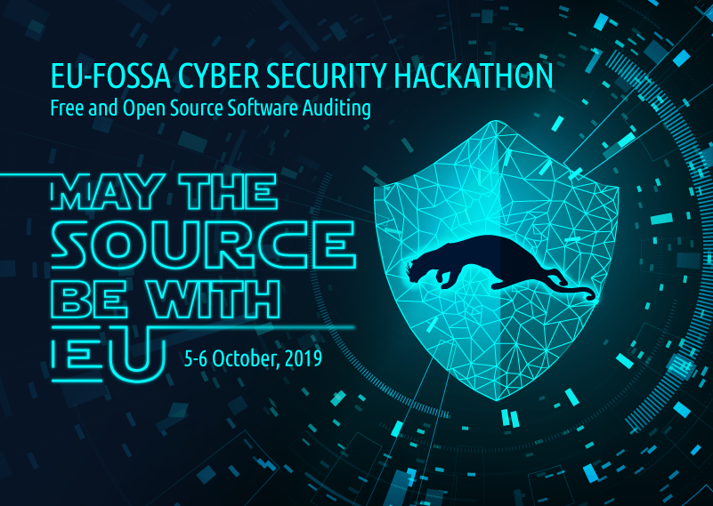
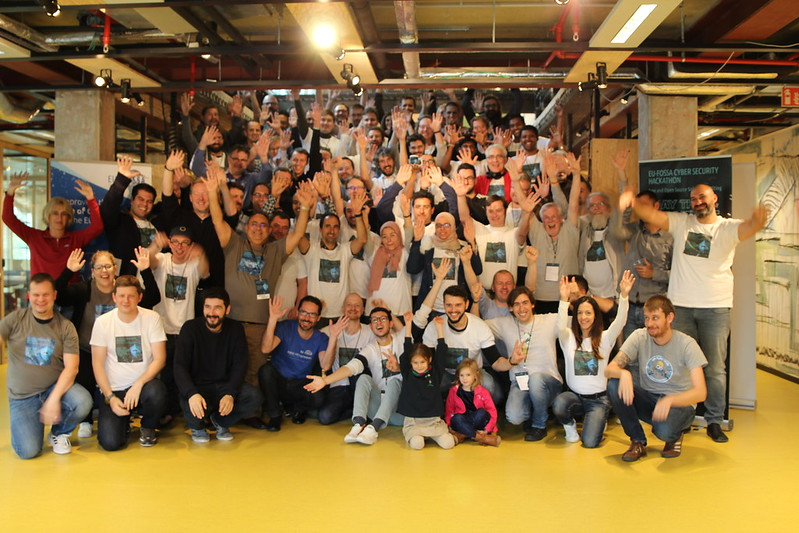

# EU-FOSSA Cyber Security Hackathon

After two successful [hackathons](https://eufossahackathon.bemyapp.com/), which strengthened the security of open source software PHP Symfony, API Platform and projects from the Apache Software Foundation; the third hackathon focussed on the security of the EU's developed open source projects.

During the weekend of 5/6 October, close to 100 developers and software architects from internal project teams and leading open source software experts from around the world, gathered in Brussels at [Silversquare Triomphe](https://silversquare.eu/location/triomphe/) to work on strengthening a select set of EU projects.

This was an EU first, and an ideal showcase of how the European Commission and institutions contribute not only to open source, but also to Cyber Security.

The event took place at the start of October, EU's [CyberSecMonth](https://cybersecuritymonth.eu/), with Europe wide live streaming of the key events.

## Achievements

Goals and achievements made by the projects maintainers and contributors during the event:

* [DSS](achievements/dss.md)
* [PHP @ EC](achievements/ecphp.md)
* [Enterprise Search](achievements/enterprise-search.md)
* [eUI](achievements/eui.md)
* [FLUX TL](achievements/flux-tl.md)
* [Let's start the conversation](achievements/conversation.md)
* [Mercure](achievements/mercure.md)
* [midPoint](achievements/midpoint.md)
* [PHPStan](achievements/phpstan.md)
* [PHPUnit](achievements/phpunit.md)
* [Workflow Integration](achievements/workflow-integration.md)
* [WSO2 API Gateway](achievements/api-gateway.md)

## Group photo

[Photo album](https://www.flickr.com/photos/bemyapp/albums/72157711187061438)

## About EU-FOSSA

The [EU-FOSSA](https://ec.europa.eu/info/departments/informatics/eu-fossa-2_en) project - short for Free and Open Source Software Auditing - aims to increase the security and integrity of critical open source software.

It was launched by the European Commission at the instigation of the European Parliament after the discovery of the Heartbleed bug in 2014.

Following the success of an initial pilot, the project was renewed for another three years.

This builds on the pilot project by extending the auditing of free and open source software through:

* setting up bug bounty programmes,
* organising hackathons, and
* engaging with developer communities.

In addition, EU-FOSSA is expanding its scope to a wider range of software projects and communities. Since the very same software used by the European institutions is also widely deployed in society, we are all already benefitting from these investments.
