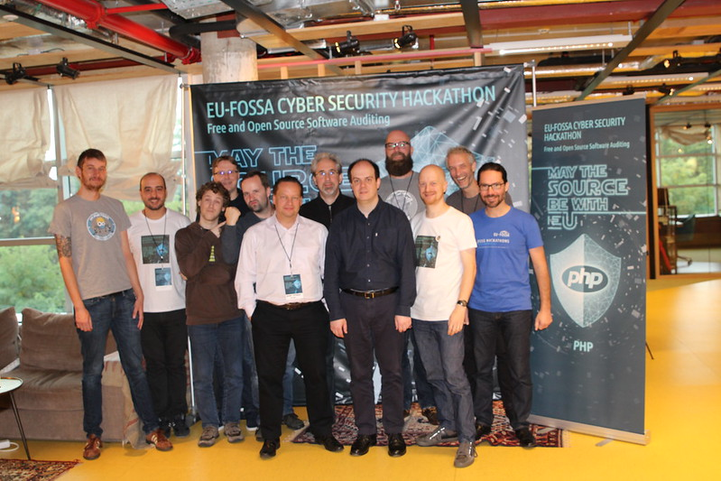

# ECPHP

## About

The [ECPHP](https://joinup.ec.europa.eu/collection/ecphp) project is an initiative of [PHP](https://www.php.net/) developers at the European Commission to make the PHP language and technologies within the Commission easier to install, use and develop with.

The goal is also to contribute back to the PHP community and develop a set of reusable open source components.

## Goals and achievements

[Custom authentication bundle for Symfony 4 and EU Login](https://github.com/eufossa/eu-hackathon-2019/issues/1)

The purpose is to work on a custom [Symfony](https://symfony.com/) bundle that will let people authenticate against the European Commission login platform 'EU Login'.

The [CAS protocol](https://apereo.github.io/cas/index.html) should be used.

[EC PHP workstation](https://github.com/eufossa/eu-hackathon-2019/issues/2)

Based on EC PHP developers requirements and EC specifications regarding the Operating System, the purpose is to write an [Ansible](https://www.ansible.com/) playbook that will allow easy and quick configuration of a modern and fully functional PHP development environment.

### Achievements

While both projects are still in development, we made a lot of progress during the event:

* Creating and initialising the repositories
* Creating the project's skeletons
* Analysing the CAS protocol to be used for authentication
* Creating the main 'roles' of the Ansible playbook and testing them against an Ubuntu workstation
* Developing a first implementation of a PHP CAS client using [PSR](https://www.php-fig.org/psr/) interfaces
* Creating connections with [PHP open source](phpunit.md) [developers](mercure.md) [and communities](phpstan.md)

